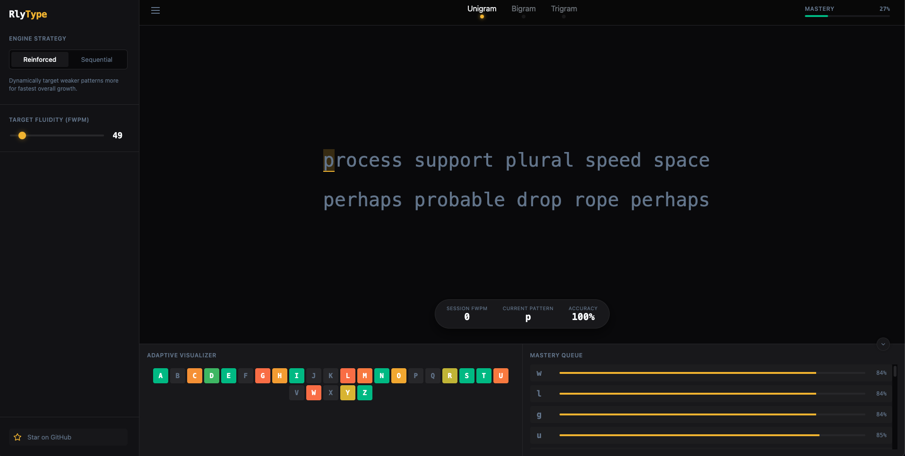
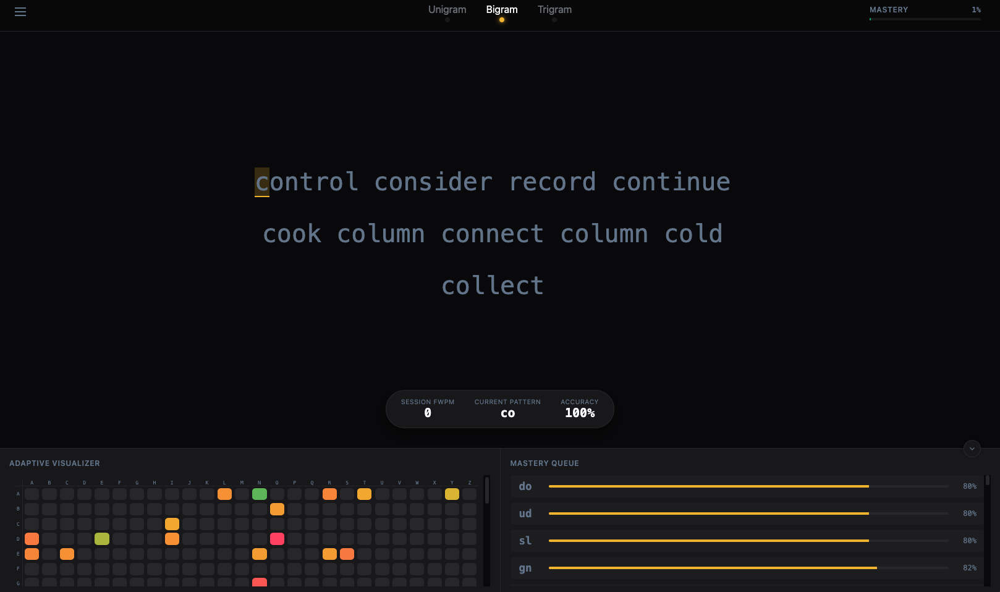

# RlyType

An adaptive, client-side typing tutor that focuses on mastering **keyboard patterns** (bigrams, trigrams, and finger movements) rather than just words.

## Project Goal

Most typing tutors focus on words or random characters. **RlyType** treats words merely as "delivery vehicles" for specific motor-skill patterns. By identifying exactly which key transitions (e.g., `th`, `ing`, `ed`) are slowing you down, the engine adapts in real-time to drill your weaknesses until they become muscle memory.

## Application Images




## How it Works

1.  **Pattern Tracking:** Every keystroke you make is measured for latency (Inter-Key Stroke Interval).
2.  **Multi-Layer Attribution:** A single keystroke updates stats for the character (Unigram), the pair (Bigram), and the triplet (Trigram).
3.  **Real-Time Adaptation:** The engine identifies "bottlenecks"—patterns where your speed is significantly below your target WPM.
4.  **Targeted Drilling:** The generator selects words from a local dictionary that specifically contain your weakest patterns.

## Features

- **Mastery-Based Progression:** Visual heatmaps and charts show your progress across Unigrams, Bigrams, and Trigrams.
- **Dynamic Learning Modes:**
  - **Reinforced:** Weighted random selection targeting weaknesses while maintaining overall flow.
  - **Sequential:** Strict drilling of your absolute weakest patterns first.
- **Offline-First:** All statistics and configurations are stored locally in your browser using IndexedDB. No server required.
- **Performance Focused:** Built with vanilla TypeScript and direct DOM manipulation for zero-latency input processing.

## Tech Stack

- **Monorepo:** Turborepo
- **Frontend:** Vite + TypeScript
- **Engine Logic:** Framework-agnostic TypeScript packages
  - `@rlytype/core`: Mastery logic and EWMA statistics.
  - `@rlytype/generator`: Inverted index and word selection.
  - `@rlytype/storage`: IndexedDB persistence layer.
  - `@rlytype/ui`: Modular rendering components.
- **Styling:** Vanilla CSS with custom properties for a modern, high-contrast UI.

## Monorepo Layout

```text
├─ apps/
│  └─ frontend/      # Main application entry and engine orchestration
├─ packages/
│  ├─ core/          # Pattern extraction and stat calculations
│  ├─ storage/       # IndexedDB persistence
│  ├─ generator/     # Word selection logic
│  ├─ ui/            # Shared UI components and renderers
│  └─ types/         # Shared TypeScript interfaces
└─ words.json        # Frequency-sorted word corpus
```

## Running Locally

1.  **Install dependencies:**
    ```bash
    npm install
    ```
2.  **Start development server:**
    ```bash
    npm run dev
    ```
3.  **Build for production:**
    ```bash
    npm run build
    ```
